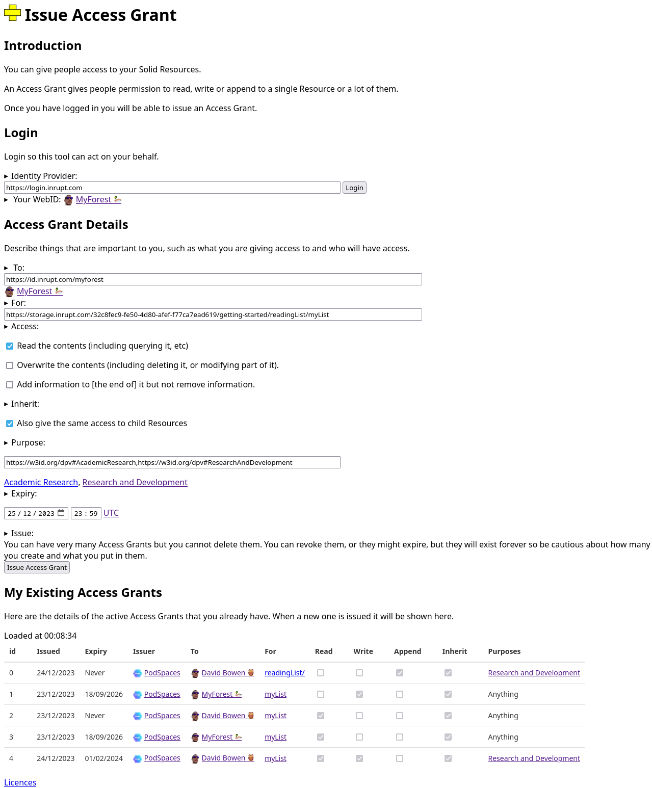

# issue-access-grant

This simplistic application allows you to issue an Access Grant for your Solid Resources.

You can find it online at [myforest.com/issue-access-grant](https://myforest.com/issue-access-grant/).

It looks something like this:



# Run locally

## Loosen security
Allow local redirects to [client-identifier.json](client-identifier.json) when logging in.

Here we are allowing redirects to localhost:

```JSON
  "redirect_uris": [
    "https://myforest.com/issue-access-grant/",
    "http://localhost:80"
  ],
```

## Install

```bash
npm install
```
## Run

This will open up in a browser on [localhost](http://localhost:8080):
```bash
npm build && npm start
```